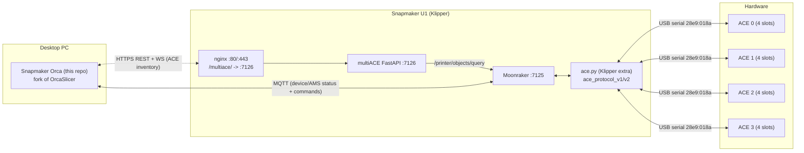
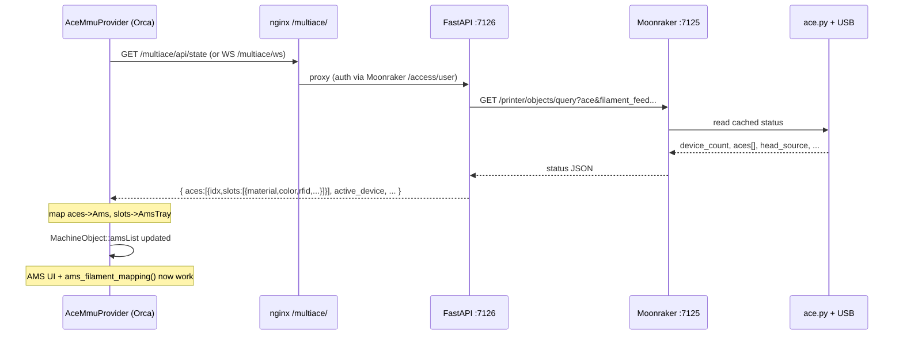

# 01 · Architecture

## 1.1 The three systems



- **ace.py** talks to the ACE units over USB serial and owns the authoritative
  state. It publishes a Klipper status object named `ace` (and helpers
  `filament_feed left/right`, `ace_bg_swap`).
- **multiACE FastAPI** (`multiace/web/backend/main.py`) queries Moonraker's
  `ace` object and reshapes it into a clean dashboard schema (`aces[]` with
  per-slot detail). It serves REST + a 1 Hz WebSocket at `/multiace/…`.
- **Snapmaker Orca** already connects to the U1 as a Bambu-style
  `MachineObject` over MQTT (`Moonraker_Mqtt`, see
  [03-orca-ams-data-model.md](03-orca-ams-data-model.md)), and separately can
  reach the printer over HTTP.

## 1.2 How the reference slicers solve multi-material

### BambuStudio (upstream)
The AMS is a first-party device. The printer firmware pushes an MQTT status
message containing an `ams` object:

```jsonc
"ams": {
  "ams": [ { "id": "0", "humidity": "...", "tray": [ { "id": "0", "tray_type": "PLA", "tray_color": "FF0000FF", ... }, ... ] } ],
  "ams_exist_bits": "1", "tray_exist_bits": "f", ...
}
```

`MachineObject::parse_json` decodes this into `amsList` (`map<string, Ams*>`),
each `Ams` holding `trayList` (`map<string, AmsTray*>`). The slicer's
`ams_filament_mapping()` then assigns each project filament to a physical tray.

### Anycubic Slicer Next (verified)
Anycubic Slicer Next is also an OrcaSlicer fork. Code search of
`ANYCUBIC-3D/AnycubicSlicerNext` confirms it **reuses the stock BambuStudio AMS
data model essentially unchanged**:

- `src/slic3r/GUI/DeviceManager.{hpp,cpp}` still defines `Ams`, `AmsTray`,
  `amsList`, and populates `info.ams_id` / `info.slot_id` in the filament-mapping
  loop.
- `src/slic3r/GUI/AmsMappingPopup.{hpp,cpp}` still has `AMS_TOTAL_COUNT 4`,
  `TrayData` with `ams_id` / `slot_id`, `td.ams_id = std::stoi(ams_iter->second->id)`.
- `src/libslic3r/ProjectTask.hpp` still carries the `FilamentInfo { ams_id,
  slot_id, ... }` fields.

**Conclusion:** Anycubic did *not* invent a new slicer-side abstraction for the
ACE. They kept the AMS model and made the **printer/cloud side emit the ACE
inventory as the AMS JSON** the slicer already understands. Each ACE box is an
AMS unit with 4 trays; multiple units use `ams_id` 0,1,2,….

This is the single most important architectural takeaway: **the AMS model *is*
the multi-material abstraction; the integration work is a data provider, not a
new subsystem.**

## 1.3 Integration options for Snapmaker Orca

We need ACE state to reach `MachineObject::amsList`. There are three ways:

### Option A — Printer-side translation into MQTT `ams` JSON (least slicer code)
Extend the printer side (multiACE / a Moonraker-MQTT bridge) to emit a
Bambu-style `ams` block in the MQTT status the U1 already publishes. Orca then
needs **zero** new code — `parse_json` fills `amsList` automatically.

- Pros: no slicer changes; matches how Bambu/Anycubic do it; works everywhere
  the device page already works.
- Cons: requires shipping/maintaining printer-side firmware changes; couples the
  slicer release to a firmware feature; harder for the slicer team to control.

### Option B — Slicer-side provider polling multiACE HTTP/WS  ✅ recommended
Add a component in Orca (`AceMmuProvider`) that connects to
`https://<printer-ip>/multiace/…` (or Moonraker `/printer/objects/query`
directly), reads `aces[].slots[]`, and **writes `amsList` on the U1's
`MachineObject`**. Everything downstream (AMS UI, filament mapping, send dialog)
already consumes `amsList`.

- Pros: fully controlled inside the slicer; matches the user's stated goal
  ("reads inventory and live state from the printer-side service … exposes …
  through the existing AMS-oriented machine model"); the JSON is already clean;
  works with stock multiACE.
- Cons: a second transport alongside MQTT; must be reconciled with the MQTT
  push path so both don't fight over `amsList`.

### Option C — Hybrid
Use Option B for inventory (rich, clean, RFID/dryer/humidity), but keep MQTT for
live print/toolchange state. This is the natural end-state.

**Recommendation:** implement **Option B** first (self-contained, testable,
matches the goal), designed so it can later be complemented by Option A/C if the
printer side gains native MQTT `ams` output. The rest of these docs assume
Option B.

## 1.4 End-to-end data flow (Option B)



At slice/print time the reverse direction applies: the filament→slot mapping
produces `T = ace*4 + slot` virtual tool indices in the exported gcode, which
multiACE's post-processor rewrites into `ACE_SWAP_HEAD HEAD=h ACE=a SLOT=s`
(see [06-slicing-gcode-mapping.md](06-slicing-gcode-mapping.md)).

## 1.5 Scope boundaries

In scope for this integration:
- Discovering/enumerating ACE units and slots.
- Populating `amsList` (type, colour, brand, RFID, exists/empty, humidity, dryer).
- Surfacing them in the existing AMS UI + filament-mapping popup.
- Correct virtual-tool-index emission for multiACE's post-processor.

Out of scope (owned by the printer side / multiACE):
- The physical load/unload/swap mechanics and retries.
- The in-print `ACE_SWAP_HEAD` orchestration and background swaps.
- Firmware installation and USB wiring.
