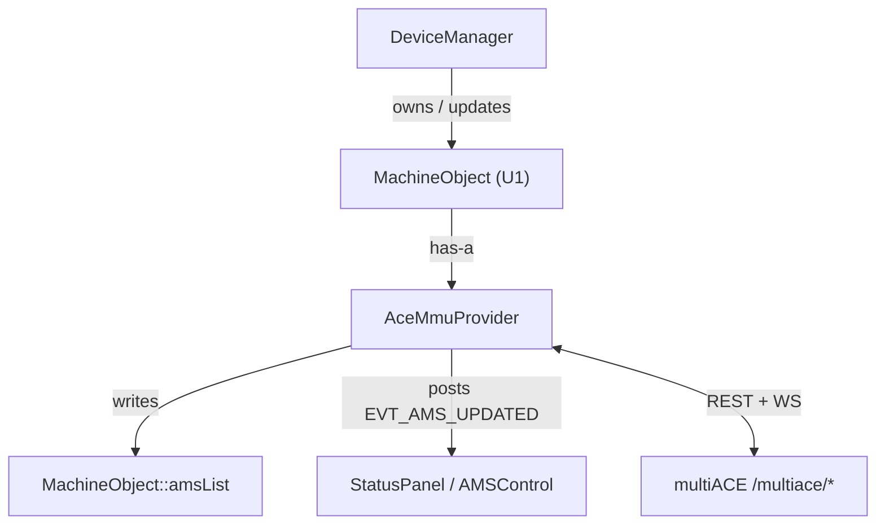

# 04 · Provider Design — `AceMmuProvider`

This document proposes the concrete component. It is a design, not final code;
names are suggestions consistent with the codebase's conventions.

## 4.1 Responsibilities

1. Own a network client to the printer-side multiACE service (REST + WebSocket),
   scoped to a specific U1 `MachineObject` (via `dev_ip` + credentials).
2. Periodically/eventfully fetch ACE inventory + live state.
3. Translate `aces[].slots[]` → `Ams`/`AmsTray` and update
   `MachineObject::amsList` (+ `ams_exist_bits`, `tray_exist_bits`).
4. Signal the GUI to refresh (reuse the existing AMS update path).
5. Optionally expose write helpers (load/unload/switch) that post gcode macros.
6. Coexist cleanly with the MQTT push path so the two do not clobber each other.

## 4.2 Placement

- New files: `src/slic3r/GUI/AceMmuProvider.hpp` / `.cpp` (GUI layer, because it
  writes into `MachineObject` and drives GUI refresh — same layer as
  `DeviceManager`).
- Networking: reuse the project's HTTP client
  (`src/slic3r/Utils/Http.{hpp,cpp}`) for REST; for the WebSocket reuse the
  approach already used by `Moonraker_Mqtt` / the Boost.Beast usage in
  `Utils/` (or poll REST if a WS client is not readily available in this layer).
- CMake: add the new files to `src/slic3r/CMakeLists.txt` alongside the other
  GUI sources.

## 4.3 Ownership & lifecycle



- The provider is created/attached when the U1 `MachineObject` is selected and it
  is detected to be an ACE-capable U1 (see capability detection,
  [05 §Phase 2](05-implementation-plan.md)).
- It starts a background worker (thread or async loop) that maintains the WS
  connection (fallback: REST poll every 2–5 s).
- On teardown/disconnect it stops the worker and detaches.
- All `amsList` mutations happen on the GUI/main thread (marshal via
  `wxCommandEvent` / `CallAfter`), matching how `parse_json` runs.

## 4.4 Proposed interface (sketch)

```cpp
// AceMmuProvider.hpp  (namespace Slic3r::GUI)
struct AceSlot {
    int         idx;            // 0..3
    bool        occupied;       // state != empty && raw != 0
    std::string state;          // ready|loading|...
    std::string material;       // "PLA"
    std::string brand, sku, subtype;
    std::string color_rrggbb;   // "#rrggbb" or empty
    int         rgb[3];         // or {-1,-1,-1}
    int         rfid;           // 0 | 2
    std::string source;         // rfid|override|derived|empty
};
struct AceUnit {
    int         idx;            // 0..3  -> Ams.id
    bool        connected;
    std::string protocol;       // "" | v1 | v2
    float       temp;
    int         humidity;       // 1..5
    // dryer fields as needed
    std::vector<AceSlot> slots; // size 4
};
struct AceSnapshot {
    int devices = 0;            // device_count
    int active_device = 0;
    std::string mode;           // normal|multi|head
    std::vector<AceUnit> units;
    // toolheads[] optionally, for live active-slot display
};

class AceMmuProvider {
public:
    AceMmuProvider(MachineObject* obj);
    ~AceMmuProvider();

    void start();     // begin WS/poll worker
    void stop();
    bool is_running() const;

    // called on GUI thread with a fresh snapshot
    void apply_snapshot(const AceSnapshot& snap);   // writes amsList + bits

    // optional write helpers (post to /api/macro or MQTT)
    int  cmd_switch_ace(int ace);                   // ACE_SWITCH TARGET=ace
    int  cmd_load_head(int head, int ace);          // ACE_LOAD_HEAD/ACE_SWAP_HEAD
    int  cmd_unload_head(int head);
    int  cmd_dry_start(int ace);
    int  cmd_dry_stop();

private:
    MachineObject* m_obj;
    std::string    m_base_url;   // https://<dev_ip>/multiace
    // http client, ws client, worker thread, last-good snapshot, backoff...
};
```

## 4.5 Field mapping table (multiACE → Orca AMS)

Applied per ACE unit and per slot in `apply_snapshot()`:

### Unit level — `AceUnit` → `Ams`

| multiACE (`aces[i]`) | Orca (`Ams`) | Notes |
|----------------------|--------------|-------|
| `idx` | `Ams::id = std::to_string(idx)` | Also key in `amsList` |
| — | `Ams::nozzle = MAIN_NOZZLE_ID` | U1 is single-nozzle for ACE feed |
| — | `Ams::type = 1` (`ams`) | Treat ACE as a standard AMS type |
| `connected` | `Ams::is_exists` | Also set `ams_exist_bits` bit `idx` |
| `humidity` | `Ams::humidity` | Already a 1..5 bucket |
| `temp` | `Ams::current_temperature` | `INVALID_AMS_TEMPERATURE` if null |
| `dryer.remaining` | `Ams::left_dry_time` | If exposed |

### Slot level — `AceSlot` → `AmsTray`

| multiACE (`slots[s]`) | Orca (`AmsTray`) | Notes |
|-----------------------|------------------|-------|
| `idx` | `AmsTray::id = std::to_string(idx)` | Key in `trayList` |
| `occupied` | `AmsTray::is_exists` | Also set `tray_exist_bits` bit `idx*? ` → `unit*4+slot` |
| `material` | `AmsTray::type` | Filament type used for compatibility |
| `color` `#rrggbb` | `AmsTray::color` = `RRGGBBAA` | Strip `#`, uppercase, append `FF` |
| `color_rgb` | `AmsTray::wx_color` | Optional convenience |
| `brand` | `AmsTray::sub_brands` | Vendor |
| `sku`/`subtype` | (extend or store in `sub_brands`) | Display only |
| `rfid==2` | `AmsTray::tag_uid` non-"0" | Marks RFID-known spool |
| — | `AmsTray::setting_id` | Best-effort: match to a filament preset id via `material`+`brand` (see below) |
| `state` | (drives `is_exists`/UI) | Map `empty`→not exists |

**Colour conversion:** `"#ff0000"` → `"FF0000FF"`. Reuse the inverse of
`AmsTray::decode_color`. Empty/`null` → default white `"FFFFFFFF"`.

**Preset resolution (`setting_id`):** to make the spool auto-select a real
filament preset, resolve `material`+`brand`(+`subtype`) to a Snapmaker/Orca
filament preset id. Start simple (leave `setting_id` empty → user picks in the
mapping popup) and iterate; a lookup table can be added later (mirrors how the
Bambu path fills `tray_info_idx`).

### Bits

```cpp
obj->ams_exist_bits  = 0;
obj->tray_exist_bits = 0;
for (const AceUnit& u : snap.units) {
    if (u.connected) obj->ams_exist_bits |= (1L << u.idx);
    for (const AceSlot& s : u.slots)
        if (s.occupied) obj->tray_exist_bits |= (1L << (u.idx*4 + s.idx));
}
```

## 4.6 Two ways to write `amsList`

**(a) Direct object update (recommended):** iterate `snap.units`, find-or-create
`Ams` in `amsList`, find-or-create `AmsTray` in `trayList`, assign fields per the
table, prune units/slots no longer present. This mirrors the loop already in
`parse_json` and avoids JSON round-trips.

**(b) Synthesize `ams` JSON and call `parse_json`:** build a
`{"ams":{"ams":[...],"ams_exist_bits":"...","tray_exist_bits":"..."}}` object and
call `m_obj->parse_json(j.dump())`. Pros: exercises the exact same code the MQTT
path uses (consistency, fewer surprises). Cons: must format hex bit strings and
tray fields precisely; slightly wasteful. **Good for a first spike**, then move
to (a) for control.

## 4.7 Coexistence with the MQTT push path

Risk: both the MQTT `parse_json` path and the provider write `amsList`. If the
U1's MQTT stream never contains an `ams` block (likely, since the stock U1 has no
AMS), there is no conflict and the provider is the sole writer. If the printer
side *does* start sending `ams` (Option A), the two must be reconciled:

- Add a flag on `MachineObject` (e.g. `bool ams_from_ace_provider`) and have the
  provider own `amsList` while set, ignoring/merging MQTT `ams`.
- Or gate on `type`/source so ACE-provided units are tagged and never overwritten
  by an empty MQTT push.

Guard the provider so a transient network failure (empty/failed fetch) does **not
clear** a previously-good `amsList` (keep last-good until a definitive "0 units"
is received, matching multiACE's own `_STATUS_CACHE_TTL` behaviour).

## 4.8 Refresh signalling

After `apply_snapshot()` mutates `amsList`, trigger the same refresh the MQTT
path triggers so `StatusPanel::update_ams` re-reads. Reuse the existing
device-update event/`on_push_status` mechanism rather than inventing a new one,
so the AMS tab, mapping popup, and calibration pages all update uniformly.
