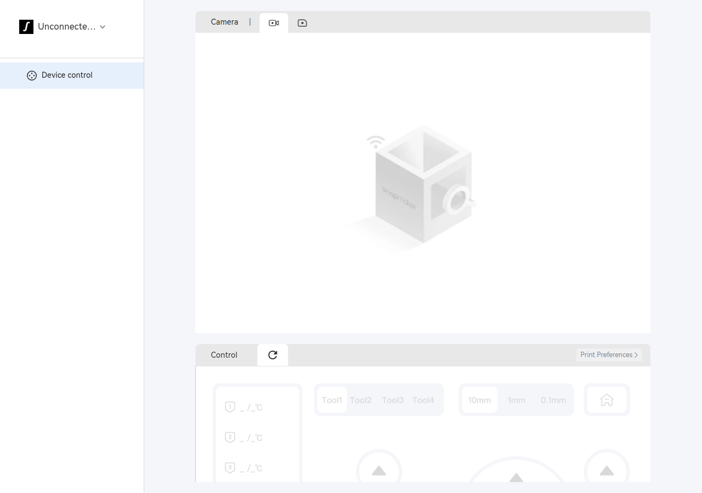
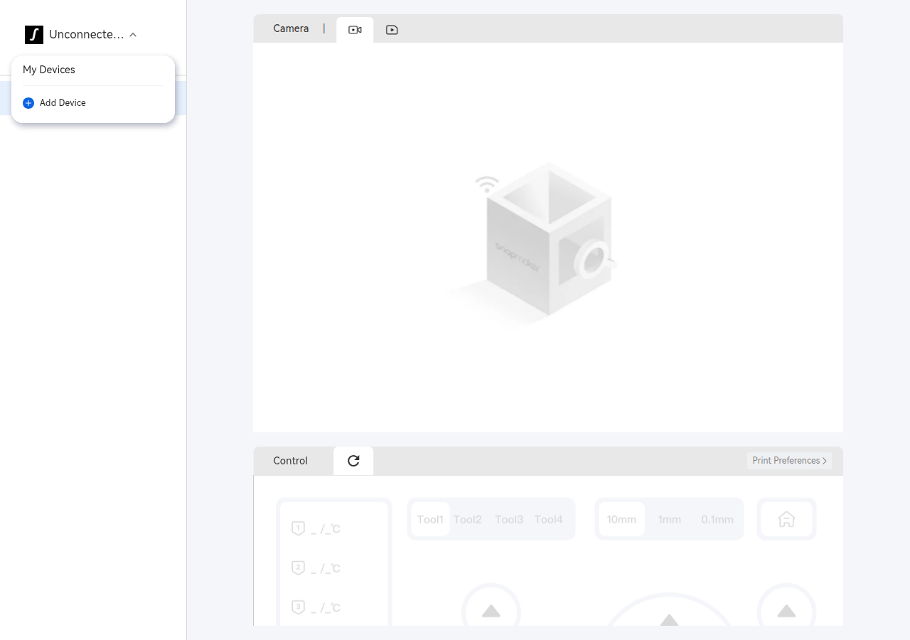
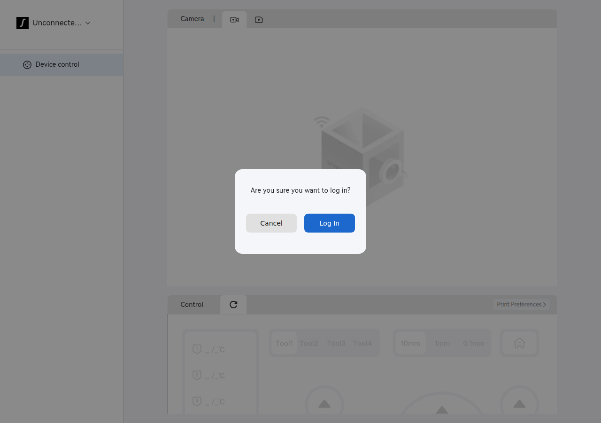

# The Device page

The Device tab, mounted by [`PrinterWebView`](../../../src/slic3r/GUI/PrinterWebView.cpp)
at `?path=2` (`AppModule.deviceControl`).

## Layout

Captured from the real bundle with the [harness](../tools/harness/README.md) at
1280 × 900, with a simulated host answering the bridge.



Three regions:

| Region | Contents |
|---|---|
| **Left rail** | the device selector (printer name + status) and a nav list — `Device control` |
| **Camera panel** | `Camera` tab, a live-view toggle and a timelapse toggle; falls back to a "no signal" U1 illustration |
| **Control panel** | `Control` tab, a refresh control, a `Print Preferences ›` link, and the control grid |

The control grid holds, left to right:

- a **temperature column** — one row per heater, rendered `_ /_ °C` until state arrives
- a **toolhead selector** — `Tool1` … `Tool4`, confirming the U1's four toolheads
- a **jog step selector** — `10mm` / `1mm` / `0.1mm`
- a **home** button, and the XY/Z jog arrows below

Everything in the control panel renders disabled while the page is not connected
to a printer — which is the state in this capture.

## The device selector



The selector opens a small menu with `My Devices` and `+ Add Device`. The device
list is not read from the bridge's `sw_GetLocalDevices` response directly; it comes
from the page's own cache, replicated through the host under the cache key
`deviceList` (and `deviceFilamentInfo` for per-device filament state) via
`sw_SubscribeCacheKey`. In this capture the cache is empty, so the list is too.

## Boot sequence

Recorded from a live boot with the harness — the page's first bridge calls, in
order, ignoring the interleaved `sw_FileLog` traffic:

```
sw_SubUserUpdatePrivacy         subscribe: privacy-policy acceptance
sw_SubscribePageStateChange     subscribe: page visible/hidden
sw_SubscribeRecentFiles         subscribe: recent files
sw_SubscribeLocalDevices        subscribe: LAN device list
sw_SubscribeCacheKey            subscribe: deviceFilamentInfo
sw_SubscribeCacheKey            subscribe: deviceList
sw_SubscribeUserLoginState      subscribe: account
sw_GetUserLoginState            one-shot:  account
sw_UploadEvent                  telemetry
sw_GetConnectedMachine          one-shot:  which printer is connected
```

Subscriptions are all established before any state is requested. `sw_FileLog` is
interleaved throughout — the page logs its own construction to the host, which is
how the [component list](../01-architecture/01-layer-model.md#the-pages-own-internal-structure)
was recovered.

## The login gate



If the account cannot be established the page overlays a modal
"Are you sure you want to log in?" gate on whatever screen is loaded — the Device
page, the print popup, and the Home page all show it.

It is reached by more paths than an actually-logged-out user. In the harness the
account handshake succeeded (`_getUserLoginState 请求成功`) and the gate *still*
appeared, because the page then calls the Snapmaker **cloud** REST API
(`getUserAwsIoTConfig`, `getCloudDeviceList`) and treats a failure there as
`_handleUserOffline`. So an unreachable cloud is indistinguishable, at this gate,
from a signed-out user — worth knowing when triaging "it asks me to log in again"
reports on a LAN-only setup.

## Connection status

The page tracks connection through several enums, all recovered in
[`reconstructed/enums.dart`](../reconstructed/enums.dart):

| Enum | Values | Role |
|---|---|---|
| `ConnectionStatus` | 7 | the live transport state — `unknown`, `connecting`, `connectedOnline`, … |
| `DeviceStatusType` | 26 | the *displayed* status, including every failure mode |
| `DeviceStatus` | 15 | what the machine is doing — `idle`, `working`, `bedLeveling`, … |
| `DeviceConnectStatus` | 10 | pairing/authorisation progress |
| `DeviceConnectionError` | 9 | why a connection attempt failed |

See [the connection state machine](02-connection-state-machine.md).
