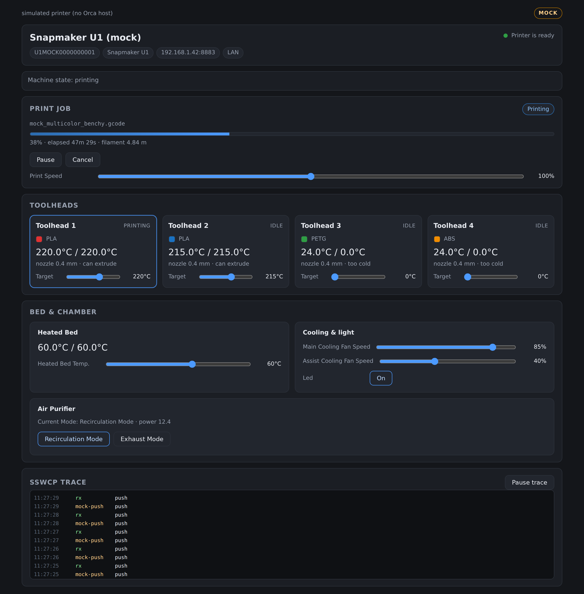
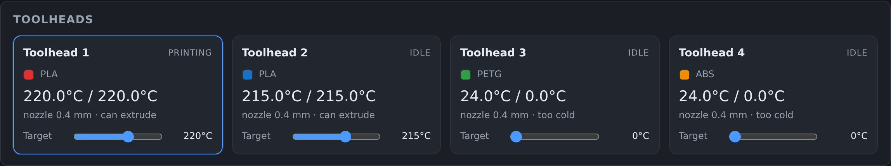
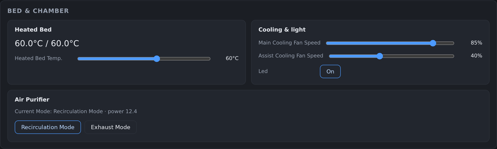
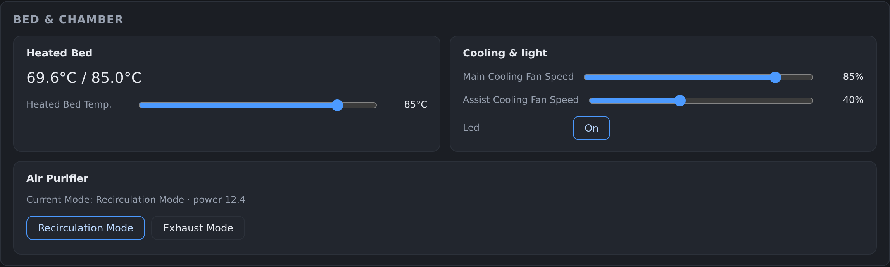
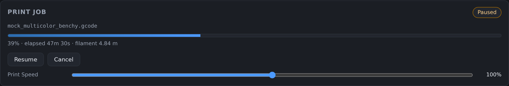
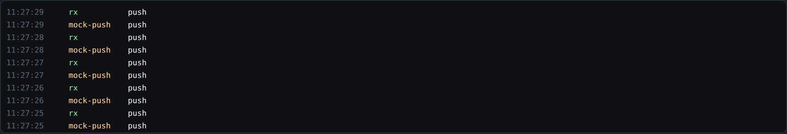
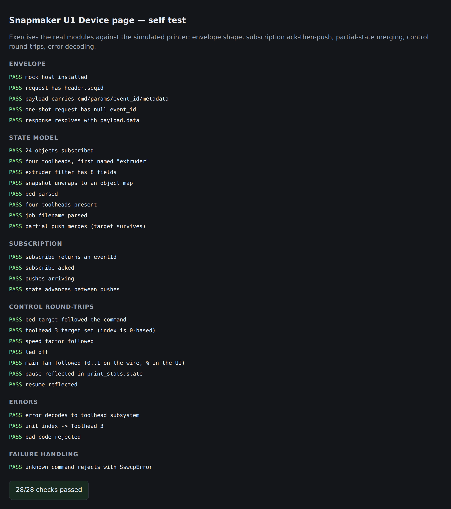

# Report — reverse engineering and reimplementation

> **The screenshots on this page are stale (flagged 2026-08-24).** Every image under
> `screenshots/01-` … `08-` shows an early dark-theme iteration of the reconstruction,
> before the panel layout was matched to the shipped page. They do not represent what the
> Device tab looks like now, and should not be used to judge parity — use
> [`05-visual-reference.md`](05-visual-reference.md) and the `original-*` /
> `reconstruction-*` captures for that. They are kept only because the prose below refers
> to them; regenerating needs a working browser, which the current environment does not
> have (chromium will not start without libnspr4/libnss3).


## What was done

The Snapmaker U1 Device tab in Orca is a compiled Flutter web app
(`resources/web/flutter_web/`, 5.2 MB of dart2js output, no source maps). It was
reverse engineered end to end, and then **reimplemented from the documentation alone**
as a plain HTML/JS page, to prove the documentation is correct and complete.

| | |
|---|---|
| Bundle analysed | orca **2.3.26**, build 20260813142841 |
| Bridge commands recovered | **111** live (117 called by the page, 127 dispatched by Orca) |
| JSON-RPC methods recovered | **35**, with literal parameter names |
| State model | **24** objects with per-object field filters |
| Dart classes recovered | **163** original class names, ~105 domain classes |
| Error codes catalogued | **442**, with a decoded 4-group code scheme |
| Reimplementation | ~900 lines of JS, no dependencies, no build step |
| Tests | 12 conformance checks + 28 browser assertions, all passing |

## How the bundle gave itself up

dart2js minifies identifiers but not string literals. Three consequences made this
tractable:

1. **Method names and wire keys survive**, so the JSON-RPC envelopes the page builds are
   readable verbatim.
2. **`toString()` bodies survive.** Dart's conventional `toString` embeds the class name
   and field names as a literal, which recovered the entire domain model —
   `WcpPacket`, `RequestPayload`, `Extruder`, `PrintTaskConfig`, `DeviceCertConfig` and
   160 more — despite minification.
3. **Constant lists survive**, so the subscription list and field filters came out intact.

Two further affordances in the shipping build: the renderer is `html`, not CanvasKit,
so the page is real DOM; and `PrinterWebView::update_mode()` enables DevTools
unconditionally (the `developer_mode` check is commented out), so the live page can be
inspected in a release build.

Everything was cross-checked against Orca's own C++ — `SSWCP.cpp` (7,685 lines) and
`MoonRaker.cpp` (3,006 lines) — rather than trusted from the bundle alone.

## Headline findings

- **The U1 runs Klipper**, behind a Moonraker-derived JSON-RPC 2.0 API with Snapmaker
  extensions (`printer.control.*`, `server.client_manager.*`, `camera.*`, `custom.*`).
- **Transport is MQTT over mutual TLS**, not HTTP, with topics namespaced by serial
  number: `<SN>/request`, `/response`, `/status`, `/notification`.
- **Pairing** is a plain-MQTT `server.request_key` handshake against `<auth_code>/config/request`
  that returns the mTLS material; the cloud path gets the same material from
  `/user/device/getMqttCert`.
- **The Flutter page owns the protocol.** Orca's C++ is transport and policy. That is
  why a replacement client is straightforward.
- Left in the shipping bundle: a developer route menu, test-only routes, and an internal
  Snapmaker host `http://172.17.100.32:8100/api`.

## The reimplementation

`resources/web/device_page/` implements the live machine-control surface: four
toolheads, heated bed, fans, chamber LED, air purifier, print job control, print speed,
fault decoding, and a live protocol trace.

It auto-detects its host — real Orca bridge when `window.wx` exists, a simulated U1
otherwise — so it runs with no hardware.

### Running Device page, mid-print

Four toolheads with their filament assignments, the active head highlighted, live
temperatures, and the SSWCP trace at the bottom.



### Toolhead grid

`extruder`, `extruder1`, `extruder2`, `extruder3` — Klipper names the first head
`extruder`, not `extruder0`. Filament type and colour come from `print_task_config`.



### Bed, cooling, light and purifier

Slider ranges are the shipped limits, not guesses: bed 0–100 °C and print speed
50–150 % come from `dialog_device_control_modify_*_tips` in the bundle's i18n table.
The purifier's two modes are `Recirculation Mode` / `Exhaust Mode`.



### Control round-trip

Bed target driven to 85 °C via `sw_ControlBedTemp{temp:85}`; the change comes back on
the next `heater_bed` state push and the UI follows.



### Pause

`sw_MachinePrintPause` → `print_stats.state` becomes `paused`, and the button becomes
Resume.



### Fault decoding

Codes are 16 hex digits in four groups — `SSSS MMMM UUUU EEEE`. Here
`0002052300020000` decodes to subsystem `0523` (toolhead), unit index 2 → **Toolhead 3**.
The catalogue entry for that code is "Filament runout detected in Toolhead 3".


### Live protocol trace

Every packet in and out, so the bridge can be watched while the page runs.



## Verification

Two independent test layers, both passing.

**1. Conformance** — re-derives the constant tables from `data/` and fails if
`js/protocol.js` has drifted. This is the guard that ties the code to the evidence.

```
12/12 checks passed
```

It was negative-controlled: injecting a wrong field filter, a bogus command name and a
wrong temperature limit produced three failures and a non-zero exit, so it can go red.

**2. Browser end-to-end** — drives the real modules against the simulated printer in
headless Chromium.



```
28/28 checks passed
```

Covering: envelope shape (`header.seqid`, `payload.{cmd,params,event_id,metadata}`),
one-shot vs subscription, ack-then-push ordering, partial-state merging (a push carrying
only `temperature` must not erase `target`), control round-trips for bed, nozzle, speed,
LED and fan, pause/resume reflected in `print_stats.state`, error decoding, and
`SswcpError` on an unknown command.

## Reproducing

```bash
python3 docs/u1-webui/tools/run_all.py                      # regenerate all data/
python3 resources/web/shared/tests/conformance_test.py       # constants vs evidence
python3 resources/web/device_page/tests/run_selftest.py           # browser e2e (playwright)
python3 resources/web/device_page/tests/capture_screenshots.py docs/u1-webui/02-device-page/screenshots
```

## Honest limits

- The reimplementation covers **live machine control only**. Discovery, pairing, cloud
  login, file browser, camera, timelapse, firmware update and filament-mapping dialogs
  are documented but not built.
- Everything was verified against a **simulator built from the same documentation**, so
  the tests prove internal consistency and that the client logic works — they do not
  prove the printer agrees. Validating against real U1 hardware is the outstanding step.
- Printer-side semantics are inferred from the client contract and Orca's C++, not from
  firmware. The error-class field (`0001`/`0002`/`0003`) is observed but its exact
  severity meaning is unconfirmed.
- Parameters marked *dynamic* in the RPC reference are assembled at runtime, so their key
  lists are not literals in the bundle and are not fully recovered.
