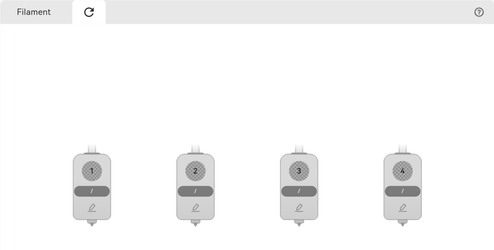
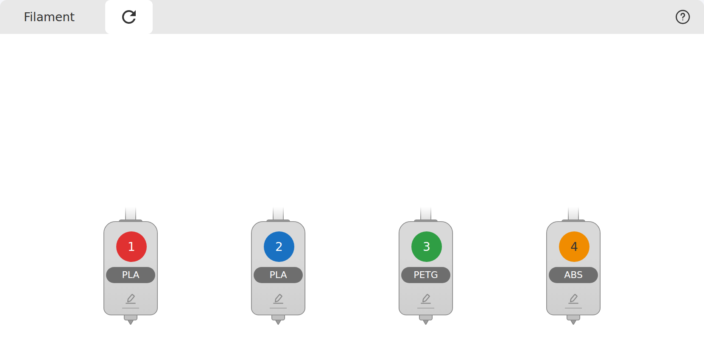
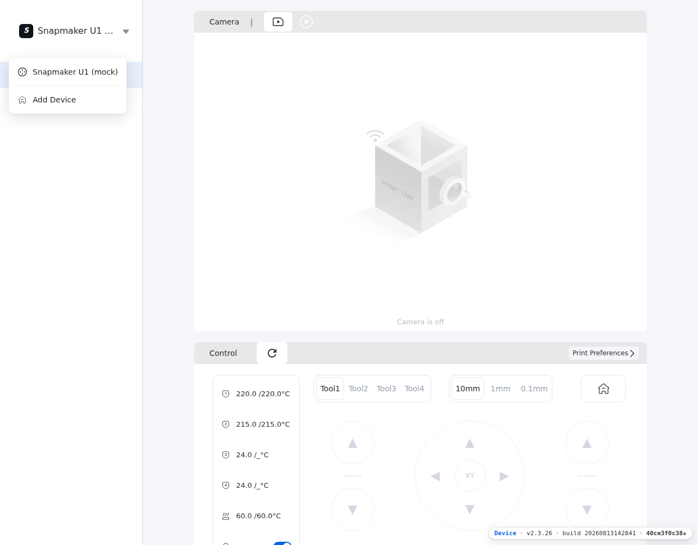
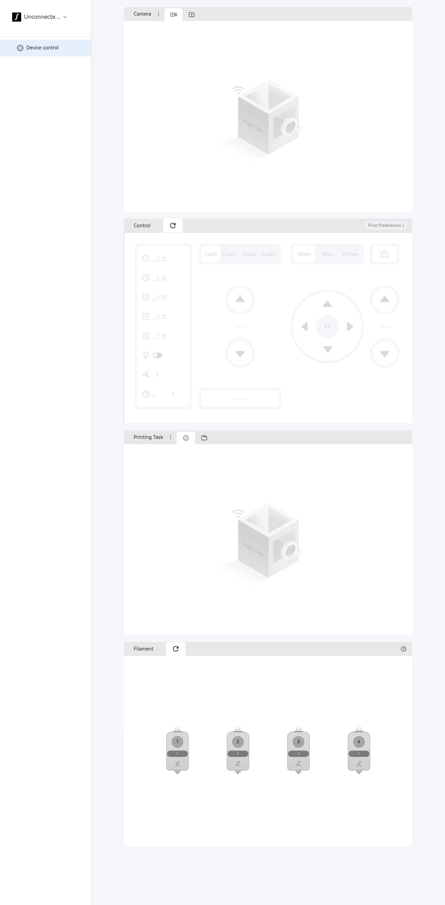
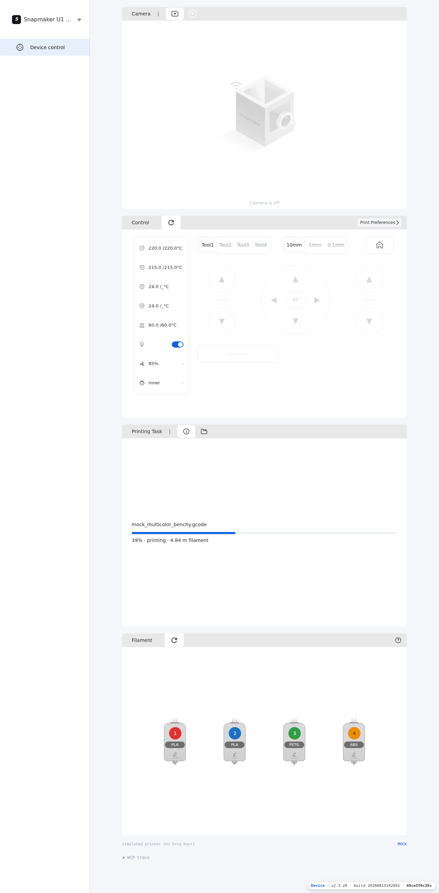

# Visual reference — measuring the shipped Device page

The first reconstruction of this surface was functionally faithful and visually
unrelated: a dark dashboard where the real page is a light, three-panel layout. This
page records how the real one was measured, so a rebuild matches it rather than
approximating it.

## Why measurement was possible

The bundle's renderer is `html`, not CanvasKit — so the page is real DOM, and its
computed styles can be read out of a running instance. Two caveats:

1. Everything lives inside a **shadow root** on `<flt-glass-pane>`. A DOM walk that
   only follows `element.children` finds two nodes; it has to descend into
   `element.shadowRoot` as well.
2. Flutter flattens some subtrees into **raster layers** — the control panel's interior
   comes through as a single 803×509 ``. Those regions were measured from pixels
   instead.

The probe is `tools/harness/` plus a DOM walk; see the harness README.

## Measured frame

Captured at 1280×900, with the simulated host attached.

| Element | Position | Size | Fill |
|---|---|---|---|
| Left rail | `0, 0` | `262 × full` | `#FFFFFF` |
| Rail divider | `x 262` | `1px` | `#D9D9D9` |
| Device selector text | `69, 39` | 16px | `#333333` |
| Nav row (selected) | `0, 114` | `262 × 48` | `rgba(12, 99, 226, .10)` |
| Nav label | `76, 129` | 14px | `#242424` |
| Panel column | `x 356` | `830` wide | — |
| Panel header | `356, 20` | `830 × 40` | `#E8E8E8`, radius `8px 8px 0 0` |
| Header title | `384, 31` | 14px | `#333333` |
| Header separator `\|` | `455, 31` | 14px | `#666666` |
| Selected tab pill | `473, 24` | `52 × 36` | `#FFFFFF`, radius `6px` |
| Panel body | `356, 60` | `830 × 548` | `#FFFFFF` |
| Control header | `356, 628` | `830 × 40` | `#E8E8E8` |
| Control refresh pill | `469, 628` | `56 × 40` | `#FFFFFF`, radius `6px` |
| Print Preferences pill | `1051, 636` | `120 × 24` | `#F5F6FA`, radius `4px` |
| Page ground | — | — | `#F5F6FA` |

The 830px column sits centred in the space right of the rail: `1280 − 262 = 1018`,
`(1018 − 830) / 2 = 94` each side. Panels stack with a 20px gap.

Note the two headers differ: **Camera** has a `|` separator between title and tabs,
**Control** does not — its refresh pill simply starts 36px after the title.

## Four panels, not one dashboard

Top to bottom: **Camera**, **Control**, **Printing Task**, **Filament**. Each is a 40px
header bar over a **548px** white body, which is what puts the four headers at
`y = 20 / 628 / 1236 / 1844`. Measuring at a viewport shorter than ~2400px hides the
Filament panel entirely — the first pass at this page missed it for exactly that reason.

The Camera body shows the bundle's own `deviceNotConnected.webp` (803×509, drawn at
panel width) when there is no stream.

The Control body holds, left to right:

- a bordered status card, ~160px wide: four toolhead temperature rows, bed, an LED
  toggle, a fan row and a purifier row, each ~56px tall
- a `Tool1…Tool4` segmented selector (233px) and a `10mm / 1mm / 0.1mm` selector
  (205px), with an 83px home button at the right
- a jog cluster: an extruder column, the XY rosette with its centre hub, and a Z column
- a wide extrude bar beneath

**The shipped page renders this whole surface and fades it while the machine is
unreachable** — it does not hide it. The reconstruction matches that: `.control-grid`
carries `data-enabled="0"` and drops to 18% opacity.

## The Filament panel



*The shipped panel, with all four slots empty.*

Header: title, a 37px gap, the refresh pill, and a `?` help glyph right-aligned at
`1151, 1854` (20×20). Body holds four slot cards:

| | |
|---|---|
| Card | `64 × 140`, the bundle's own `extruderBackground.svg` |
| First card at | `x 478, y 2085` |
| Pitch | `174px` (so a 110px gap between cards) |
| Slot circle | `+15, +29`, `36 × 36` |
| Filament bar | `+3, +71`, `58 × 19`, `#6E6E6E` |
| Edit pencil | centred, `+100`, `20 × 20` |

An **empty** slot draws the circle as a checkerboard and the bar as `/`. A loaded slot
fills the circle with the filament colour and puts the type in the bar — both read from
`print_task_config`, the object the print-processing popup writes. See
[what the two surfaces share](../00-shared/01-shared-models.md).



*The reconstruction, against the simulated host — which is why its slots are loaded.*

## Which printer the page shows

Two bridge commands answer **different questions**, and using only the first is why a
configured printer can fail to appear at all:

| Command | Returns |
|---|---|
| `sw_GetConnectedMachine` | the `DeviceInfo` of a device whose `connected` flag is **true** — an empty object otherwise |
| `sw_GetLocalDevices` | a **bare array** of every `DeviceInfo` Orca has saved, connected or not |

```cpp
// SSWCP.cpp — only a connected device is ever returned
for (const auto& device : devices) { if (device.connected) { m_res_data = device; break; } }

// SSWCP.cpp — the list, unfiltered
auto devices = wxGetApp().app_config->get_devices();
m_res_data = devices;
```

A printer that is saved but idle — the normal state when Orca has just started — is
therefore invisible to `sw_GetConnectedMachine`. The page must ask for the list as
well, and fall back to it so the rail still names the machine.

`sw_SubscribeLocalDevices` pushes the same bare array
(`GUI_App::device_card_notify(app_config->get_devices())`).

### Field names are the C++ struct's

`DeviceInfo` is serialised by `NLOHMANN_DEFINE_TYPE_INTRUSIVE`, so the wire keys are the
member names verbatim — **snake_case**, not the camelCase a JS client would guess:

```
ip  dev_id  dev_name  model_name  preset_name  connected  img  nozzle_sizes
sn  protocol  api_key  user  password  ca  cert  key  clientId  port
link_mode  userid  id
```

`shared/js/protocol.js` exports these as `DEVICE.*`, plus `asDeviceList()` (which
accepts the bare array and tolerates a `{devices: […]}` wrapper) and `deviceLabel()`.
Three conformance checks parse the field list out of `AppConfig.hpp` and fail if a
constant drifts from it.

## Interaction

Every control is wired; nothing is decorative.

| Control | Behaviour |
|---|---|
| Device selector | opens an anchored menu listing every saved printer, each marked connected or not, plus `Add Device` |
| Camera tabs | switch live / time-lapse |
| Control + Filament refresh | re-read `sw_GetConnectedMachine` and `sw_GetMachineState` |
| Print Preferences | modal with the three `print_task_config` toggles |
| Printing Task tabs | switch job info / files |
| Temperature rows | modal editor, clamped to the shipped validation limits |
| Cooling row | modal for main and assist fan |
| Purifier row | modal with Recirculation / Exhaust |
| LED | toggles, and follows the state push back from the machine |
| Tool / step selectors | select, and the jog controls use the selection |
| Jog + home | send G-code |
| Filament slot | modal to edit type and colour, written to `print_task_config` |



Menus and modals are in `js/overlay.js`; the earlier `window.prompt()` placeholders are
gone.

Motion is worth a note: **no bridge command covers jogging**, so the controls send
G-code through `sw_SendGCodes` — `G28` to home, and `G91` / `G0` / `G90` for one
relative step. The extruder column prefixes the selected tool (`T2\nG91\nG0 E0.1…`).
That the shipped page also drives motion this way is inferred from the command set, not
observed.

## Assets

The icons are the bundle's own, copied into `resources/web/device_page/icons/` so the
surface is self-contained rather than reaching into the Flutter bundle's data
directory:

`deviceControl`, `keyboardArrowDropDown`, `videoCall`, `videoImgPlay`,
`deviceActionHome`, `iconExtruder1…4`, `iconHotBedTemperature`, `iconLed`, `iconFan`,
`iconSpeed`, `exclamationMark`, `iconModelFileFolder`, `printPreferenceArrow`,
`deviceNotConnected.webp`.

One icon is **not** in the bundle: the Control header's refresh glyph is Flutter's
Material `Icons.refresh`, drawn as a path. It is recreated as `icons/refresh.svg` at
the same 24×24 box.

## Result

Re-measuring the reconstruction the same way gives the same numbers:

| | Original | Rebuilt |
|---|---|---|
| rail | `262 × #FFFFFF` | `262 × #FFFFFF` |
| nav row | `y114, 262×48, rgba(12,99,226,.1)` | `y114, 261×48`, same fill |
| camera header | `356,20 830×40 #E8E8E8` | identical |
| camera body | `356,60 830×548 #FFFFFF` | identical |
| control header | `356,628 830×40` | identical |
| panel headers | `y 20 / 628 / 1236 / 1844` | `20 / 628 / 1236 / 1844` |
| filament card | `64×140`, pitch `174` | identical |
| Print Preferences pill | `120×24 #F5F6FA` | `128×24`, same fill |



*The shipped Flutter Device page, disconnected, all four panels.*



*The reconstruction at the same viewport, against the simulated host — which is why it
shows live temperatures and loaded filament where the original shows placeholders.*

The build badge in the corner is the one intentional addition; see
[the build badge](../00-shared/02-build-badge.md).
