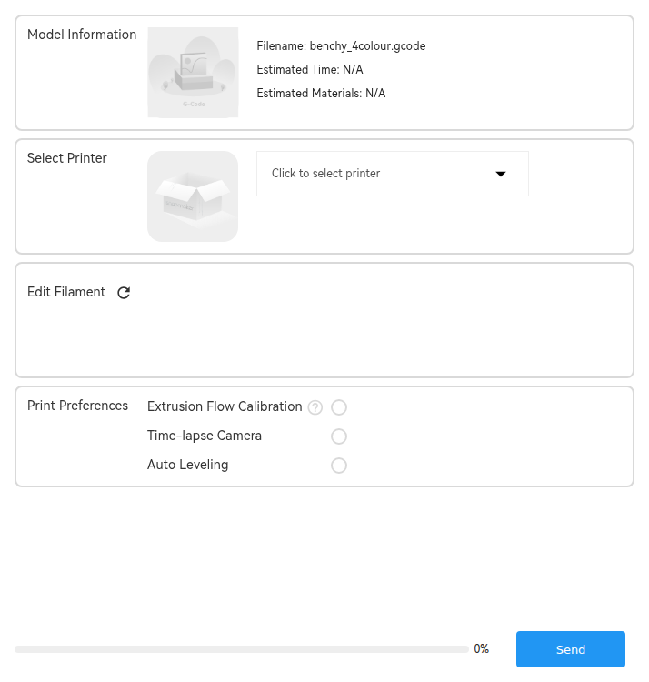
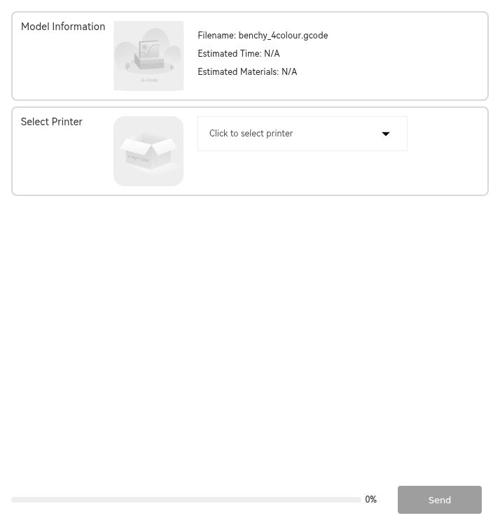

# The Print processing popup

The dialog Orca shows between "Send to printer" and the print actually starting.
It is a modal `wxDialog` wrapping a `wxWebView` that loads the same Flutter bundle
as the Device tab, at a different route.

| | |
|---|---|
| Host | [`WebPreprintDialog`](../../../src/slic3r/GUI/WebPreprintDialog.cpp) |
| Size | 714 × 750 (DIP), centred on the main frame, modal |
| Route (print) | `?path=4` → `AppModule.preUploadAndPrint` |
| Route (upload only) | `?path=5` → `AppModule.preUpload` |
| Launched from | `Plater.cpp:21964`, after `PrintHostSendDialog` |
| Bridge | the same WCP bridge as the Device page |

## Two modes, one dialog

Which route loads is decided by the post-upload action the user picked in the
preceding `PrintHostSendDialog`:

```cpp
// Plater.cpp
WebPreprintDialog* dialog = new WebPreprintDialog();
dialog->set_swtich_to_device(dlg.switch_to_device_tab());
dialog->set_send_page(dlg.post_action() == PrintHostPostUploadAction::None);
dialog->set_gcode_file_name(upload_job.upload_data.source_path.string());
dialog->set_display_file_name(upload_job.upload_data.upload_path.string());
bool res = dialog->run();
```

```cpp
// WebPreprintDialog::run()
auto real_url = m_send_page ? get_international_url(m_preSend_url)    // path=5
                            : get_international_url(m_prePrint_url);  // path=4
this->SetTitle(m_send_page ? _L("Pretreat the uploaded content")
                           : _L("Print Preprocessing"));
```

So `post_action == None` ("just upload") → `send_page` → `path=5` → `preUpload`.
Anything else ("upload and print") → `path=4` → `preUploadAndPrint`.

## What each mode shows

Captured from the real bundle with the [harness](../tools/harness/README.md), at
the dialog's true 714 × 750.

### `?path=4` — upload and print



Four sections and a send bar:

| Section | Contents |
|---|---|
| **Model Information** | G-code thumbnail, `Filename`, `Estimated Time`, `Estimated Materials` |
| **Select Printer** | printer picker — "Click to select printer" |
| **Edit Filament** | the filament-mapping grid, with a refresh control |
| **Print Preferences** | `Extrusion Flow Calibration` (with a help tooltip), `Time-lapse Camera`, `Auto Leveling` |
| send bar | upload progress `0%` and the **Send** button |

`Filename` is `benchy_4colour.gcode` in the capture because that is what the
simulated host returned for `sw_GetActiveFile` — it is the value Orca passes down
through `SSWCP::update_display_filename()`.

### `?path=5` — upload only



The same screen with the print-specific half removed: **Model Information** and
**Select Printer** only. No filament mapping, no print preferences — and the
**Send** button is rendered disabled until a printer is chosen.

This is the clearest confirmation that the route names mean what they say, and
that the `path=4`/`path=5` ↔ enum-index crossing described in
[entry points](../01-architecture/03-entry-points.md) does not affect behaviour.

## The three print-preference toggles

These map onto fields of the `print_task_config` Klipper object that the Device
page also subscribes to (see [state model](../05-printer-protocol/04-state-model.md)):

| UI label | `print_task_config` field |
|---|---|
| Extrusion Flow Calibration | `flow_calibrate`, `flow_calib_extruders` |
| Time-lapse Camera | `time_lapse_camera` |
| Auto Leveling | `auto_bed_leveling` |

The same object also carries `shaper_calibrate`, `auto_replenish_filament`,
`can_auto_replenish` and `auto_replenish_index`, which the popup does not expose —
those are driven from the Device page or the printer itself.

## Commands used by this surface

| Command | Role |
|---|---|
| `sw_GetActiveFile` | the file Orca is about to send |
| `sw_GetPrintZip` | packages G-code + metadata into a zip, off the UI thread |
| `sw_GetPrintLegal` | checks the loaded preset matches the connected model |
| `sw_GetFileFilamentMapping` | reads the slice result's filament requirements |
| `sw_UpdateMachineFilamentInfo` | writes the chosen mapping back |
| `sw_SetFilamentMappingComplete` | marks the mapping accepted or cancelled |
| `sw_FinishFilamentMapping` | closes the dialog |
| `sw_FinishPreprint` | reports the final outcome |
| `sw_StartLocalPrint` / `sw_StartCloudPrint` | begins the job |

`sw_GetPrintLegal` is the guard that stops you sending a plate sliced for one
model to a different one:

```cpp
m_res_data["preset_model"] = local_name;              // the edited printer preset
m_res_data["legal"] = (local_name == connected_model); // vs the connected machine
```

See [lifecycle](02-lifecycle.md) for how the dialog is opened, closed and reported.
