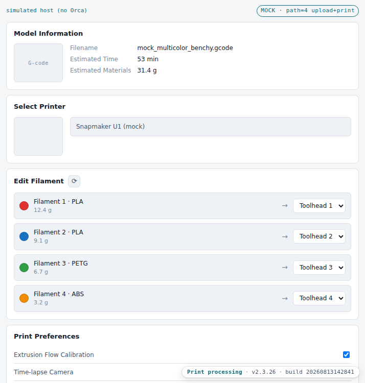
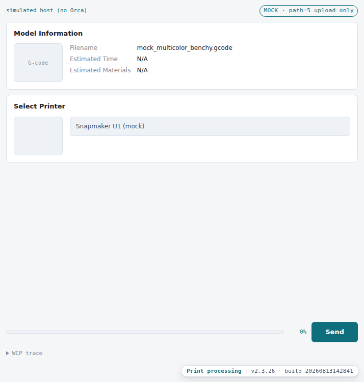

# Print popup: the reconstruction

`resources/web/print_processing/` is a dependency-free reimplementation of the
print-processing popup, built from this documentation and from the shared model layer
the Device tab already uses.

| | |
|---|---|
| Location | `resources/web/print_processing/` |
| Own code | 752 lines (`app.js`, `ui.js`, `mock.js`, `preprint.css`, `index.html`) |
| Shared code | 1,067 lines from [`resources/web/shared/`](../00-shared/01-shared-models.md) |
| Dependencies | none, no build step |
| Host | real Orca when `window.wx` exists, a simulated one otherwise |

## Two modes, one page

Orca picks the route; the reconstruction takes the same choice from a query parameter:

| Orca | Reconstruction | Shows |
|---|---|---|
| `?path=4` `preUploadAndPrint` | `?mode=print` *(default)* | all four sections |
| `?path=5` `preUpload` | `?mode=upload` | Model Information + Select Printer only |

### Upload and print



Model Information, Select Printer, Edit Filament with a row per filament and its
toolhead assignment, and the three Print Preferences toggles — over the progress bar
and Send button.

### Upload only



The print-specific half is gone, matching the shipped popup, and Send stays disabled
until a printer resolves.

The badge in the corner is the [build marker](../00-shared/02-build-badge.md).

## What it reuses

Nothing about the bridge, the state model or the filament model is re-implemented here.
The filament rows are built from `print_task_config` — the same object the Device tab
reads to label its toolheads — through the shared `MachineState` store. See
[what the two surfaces share](../00-shared/01-shared-models.md).

The one surface-specific model is the mapping edit itself: changing a row's toolhead
writes `extruder_map_table` back through `sw_UpdateMachineFilamentInfo`.

## The close protocol

The Send button follows the real three-command sequence, in order — the reconstruction
does not shortcut it, because the ordering is the part that is easy to get wrong:

```js
await bridge.request(CMD.GET_PRINT_ZIP, {});            // package
await bridge.request(CMD.START_LOCAL_PRINT, {});        // begin (print mode only)
await bridge.request(CMD.FINISH_PREPRINT, { status: 'success' });
await bridge.request(CMD.SET_FILAMENT_MAPPING_COMPLETE, { status: 'success' });
await bridge.request(CMD.FINISH_FILAMENT_MAPPING, {});  // only this closes the dialog
```

`sw_SetFilamentMappingComplete` records the outcome; `sw_FinishFilamentMapping` is what
actually ends the modal. Doing them in one step is the mistake the host's own
`SafeEndModal` guard exists to survive — see [lifecycle](02-lifecycle.md).

On failure the reconstruction reports `sw_FinishPreprint { status: 'failed' }` and
re-enables Send, rather than closing.

## Verification

The shared conformance test covers this surface too, because both surfaces import the
same constants:

```bash
python3 resources/web/shared/tests/conformance_test.py
```

```
17/17 checks passed
```

Three of those checks are the `code: 200` contract, added after a cross-check found the
earlier documentation and client had it as `0` — see
[the envelope](../04-bridge-wcp/01-envelope.md).

## Honest limits

- The printer picker is a stub: `sw_GetLocalDevices` is not wired, so "Click to select
  printer" resolves from `sw_GetConnectedMachine` only.
- Upload progress is simulated locally, not driven by a real host progress channel.
- `sw_GetPrintZip` is called but its returned content is not used — there is nothing to
  upload to without a printer.
- Verified against the shared simulator, which is built from the same documentation. As
  with the Device tab, that proves internal consistency, not that a real U1 agrees.
